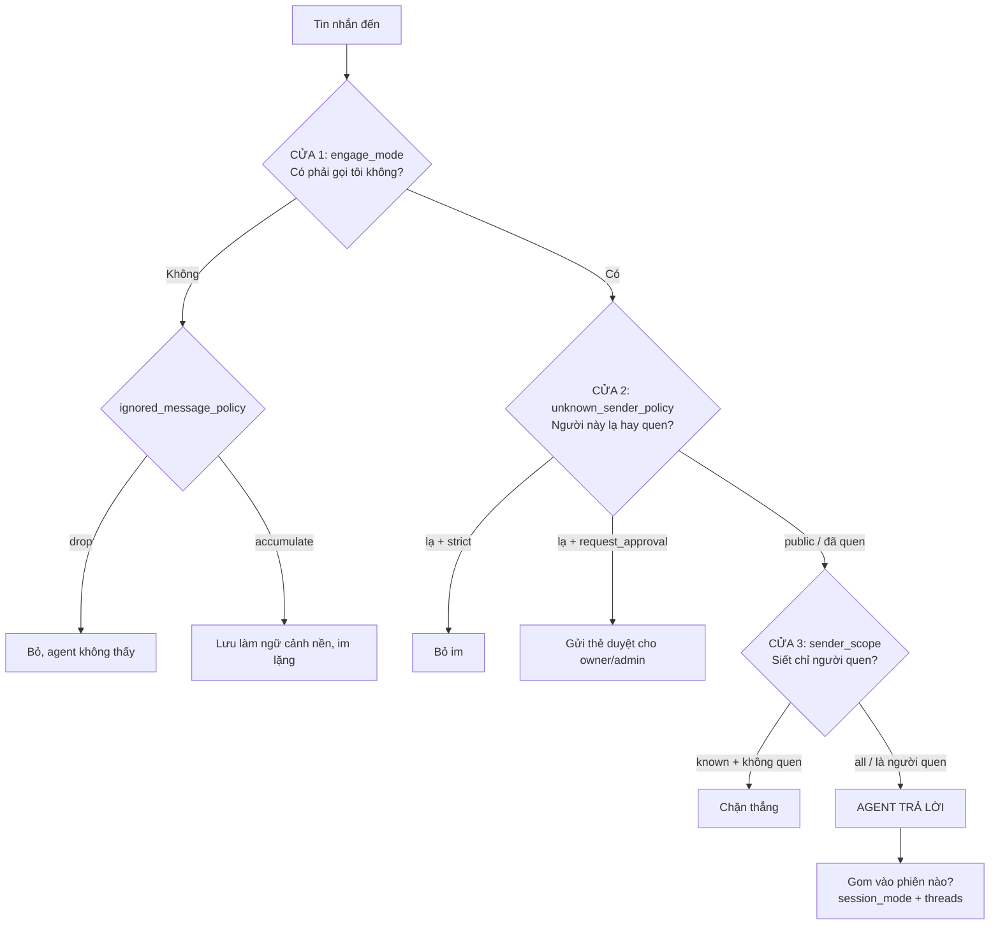

# Session, Engagement và Bản đồ cấu hình Wiring (tiếng Việt)

Tài liệu này giải thích cách một tin nhắn từ nền tảng (ví dụ Microsoft Teams) được
định tuyến tới agent, khi nào agent phản hồi, ai được phép, và cách các tin được
gom thành phiên (session). Viết cho cả người không rành kỹ thuật, kèm tham chiếu
mã nguồn cho người cần đào sâu.

Teams được dùng làm ví dụ xuyên suốt, nhưng mô hình áp dụng cho mọi channel.

---

## 1. Tóm tắt nhanh

- **Mỗi thread (chuỗi trả lời) trong một channel = một session riêng** (với nền
  tảng có thread như Teams, khi thread đang bật). Cả channel/team KHÔNG gộp chung
  một session, trừ khi chủ động tắt thread.
- **`mention-sticky`**: mention một lần trong thread thì agent bám cả thread về
  sau, không cần mention lại.
- **Một tin nhắn phải qua 3 "cửa"**: (1) có kích hoạt agent không, (2) người gửi
  lạ hay quen, (3) có siết chỉ người quen không. Rớt cửa nào dừng ở đó.
- Có tổng cộng **4 khối cấu hình**: địa chỉ kênh, khi nào lên tiếng, ai được nói,
  cách gom lịch sử.

---

## 2. Mô hình session: thread = session

Session được xác định bằng bộ ba `(agent_group_id, messaging_group_id, thread_id)`
(`src/session-manager.ts` → `resolveSession`). Mỗi `thread_id` khác nhau tạo một
session và một container riêng.

Các chế độ gom session (`session_mode`):

| Chế độ | Ý nghĩa |
|---|---|
| `shared` | Một session cho cả messaging group (bỏ qua thread) |
| `per-thread` | Mỗi thread một session |
| `agent-shared` | Một session duy nhất cho cả agent group, gộp mọi kênh (kể cả xuyên nền tảng) |

**Điểm mấu chốt với Teams:** adapter khai báo `supportsThreads: true` và mặc định
nhóm là `threads: true` (`src/channels/teams.ts`). Khi thread đang bật trong một
group chat, router **tự ép `per-thread`** bất kể `session_mode` đã đặt là gì (trừ
`agent-shared`):

```
// src/router.ts (deliverToAgent)
if (threadsEnabled && effectiveSessionMode !== 'agent-shared' && mg.is_group !== 0) {
  effectiveSessionMode = 'per-thread';
}
```

Cách địa chỉ được gán (qua Chat SDK bridge mà Teams dùng, `src/channels/chat-sdk-bridge.ts`):

- `messaging_group` = channelId = `channelIdFromThreadId(thread.id)` → một channel Teams.
- `thread_id` = `thread.id` → một chuỗi trả lời cụ thể trong channel.

| Ngữ cảnh | Cấu hình threads | Kết quả session |
|---|---|---|
| Channel/nhóm Teams (mặc định) | `group.threads: true` | Mỗi thread = 1 session |
| Channel/nhóm Teams, tắt thread | `--threads false` khi tạo wiring | Cả channel = 1 session (`shared`) |
| DM (nhắn riêng) | `dm.threads: false` | Cả DM gộp về 1 session |
| Wiring đặt `agent-shared` | (giữ nguyên) | 1 session cho cả agent group, gộp mọi kênh |

---

## 3. Hành trình một tin nhắn (3 cửa)

Hãy hình dung agent là **nhân viên trực** trong phòng chat. Mỗi tin phải lần lượt
qua các cửa; rớt cửa nào thì dừng ở đó.



Tham chiếu: các cửa được đánh giá tại `src/router.ts` (`engages && accessOk && scopeOk`).

---

## 4. Bản đồ cấu hình đầy đủ (chi tiết tác động)

Có **4 khối**. Mỗi cấu hình dưới đây mô tả theo cùng một khung: **điều khiển gì →
người dùng thấy gì → hệ thống làm gì → chọn giá trị nào**.

### Khối 1 — ĐỊA CHỈ: kênh này là gì (bảng `messaging_groups`)

#### `channel_type` — nền tảng nào
- **Điều khiển:** loại nền tảng của kênh (`teams`, `slack`, `telegram`, `whatsapp`...).
- **Người dùng thấy:** quyết định **định dạng tin** agent gửi ra (Teams/Slack dùng
  markdown khác nhau, WhatsApp dùng ký hiệu riêng) và **cách định danh người dùng**:
  mọi user id có dạng `teams:<handle>`. Khi bạn cấp quyền hay thêm member, phải gõ
  đúng tiền tố này.
- **Hệ thống làm:** đây là "khóa ngữ nghĩa" (semantic key), dùng để chọn adapter,
  chọn skill định dạng, và cấu hình container.
- **Chọn khi nào:** không phải lựa chọn tùy ý, nó cố định theo nền tảng bạn kết nối.

#### `platform_id` — đúng chat/kênh nào
- **Điều khiển:** mã định danh của đúng phòng chat trên nền tảng (id channel Teams,
  id nhóm Telegram, địa chỉ email...).
- **Người dùng thấy:** nếu sai, agent sẽ trả lời **nhầm phòng**. Nếu đúng, tin đến
  và tin trả lời đi cùng một chỗ.
- **Hệ thống làm:** cùng `channel_type` + `instance` tạo thành khóa duy nhất định
  danh kênh.
- **Chọn khi nào:** thường **không tự gõ tay** — @mention bot một lần, router tự
  tạo row với `platform_id` đúng; bạn chỉ việc `ncl messaging-groups list` lấy ra.

#### `name` — tên hiển thị
- **Điều khiển:** nhãn cho người vận hành đọc.
- **Người dùng thấy:** không ảnh hưởng hành vi, chỉ để dễ nhận trong danh sách.
- **Chọn khi nào:** để adapter tự điền; sửa nếu muốn tên dễ nhớ hơn.

#### `is_group` — nhóm hay nhắn riêng
- **Điều khiển:** kênh là nhóm nhiều người (`1`) hay tin nhắn riêng 1-1 (`0`).
- **Người dùng thấy:** quyết định agent **cư xử như trong nhóm** (thường cần
  @mention mới trả lời, có thể tách phiên theo thread) hay **như trò chuyện riêng**
  (trả lời mọi tin, gộp một phiên). Đây là nguồn của rất nhiều khác biệt mặc định.
- **Hệ thống làm:** chọn nhánh default DM vs nhóm khi resolve engage/threads/policy;
  chặn `mention-sticky` trong DM.
- **Chọn khi nào:** đặt đúng bản chất chat; adapter thường tự set khi kênh lộ diện.

#### `instance` — khi chạy nhiều bot/số/app cùng một nền tảng
- **Điều khiển:** phân biệt **nhiều adapter cùng `channel_type`** (ví dụ 2 số
  WhatsApp, 3 app Slack, 2 bot Telegram token khác nhau).
- **Người dùng thấy:** **hầu như không thấy trực tiếp**. Tác động ẩn nhưng quan
  trọng: nếu bạn chạy số WhatsApp công ty và số hỗ trợ, `instance` bảo đảm khách
  nhắn vào số nào thì agent **trả lời đúng bằng số đó**, không lẫn sang số kia.
- **Hệ thống làm:** chỉ là **khóa định tuyến phía host** để chọn đúng adapter khi
  gửi ra / báo "đang gõ". Container **không bao giờ thấy** `instance`. Định dạng và
  user id vẫn theo `channel_type`, không theo `instance`.
- **Chọn khi nào:** để **mặc định** (`= channel_type`) nếu chỉ có 1 bot mỗi nền
  tảng; chỉ đặt tên riêng khi chạy từ 2 adapter cùng loại trở lên.

### Khối 2 — KHI NÀO LÊN TIẾNG (bảng `messaging_group_agents`, tức wiring)

#### `engage_mode` — khi nào agent phản hồi
- **Điều khiển:** điều kiện để agent lên tiếng. Ba giá trị: `mention`,
  `mention-sticky`, `pattern`. Chi tiết cơ chế ở **mục 5**.
- **Người dùng thấy:** khác biệt trực tiếp nhất trong trải nghiệm:
  - `mention`: agent **im** cho tới khi bị @gọi tên; mỗi lần cần đều phải gọi lại.
  - `mention-sticky`: gọi **một lần** trong thread rồi agent **bám cả thread**.
  - `pattern`: agent phản ứng theo **từ khóa/mẫu chữ**, có thể luôn trả lời (`.`).
- **Hệ thống làm:** cửa 1 (`evaluateEngage`); với `mention-sticky` còn kích hoạt
  `subscribe` để nền tảng đẩy tin follow-up vào bot.
- **Chọn khi nào:**
  - `mention` → phòng đông người, chỉ muốn agent nói khi được gọi đích danh.
  - `mention-sticky` → muốn hội thoại liên tục trong một thread sau khi khai hỏa.
  - `pattern` → nền tảng không có mention thật, hoặc muốn agent luôn trực (`.`),
    hoặc phân biệt nhiều agent trong một phòng bằng tên.

#### `engage_pattern` — mẫu chữ để bắt (chỉ cho `pattern`)
- **Điều khiển:** biểu thức regex mà mọi tin bị soi.
- **Người dùng thấy:** quyết định **"câu thần chú"** đánh thức agent. Ví dụ
  `(?i)^@?trợ lý\b` nghĩa là gõ "trợ lý ..." ở đầu câu thì agent trả lời. `.` =
  bắt **mọi** tin (agent trực 24/7).
- **Hệ thống làm:** test regex lên nội dung; regex sai cú pháp thì "mở cửa" (trả
  lời) để admin thấy và sửa.
- **Chọn khi nào:** dùng khi `engage_mode=pattern`; bắt buộc có khi ở chế độ này.
  Bỏ qua hoàn toàn với `mention`/`mention-sticky`.

### Khối 3 — AI ĐƯỢC NÓI CHUYỆN (2 cửa + danh sách người quen)

#### `unknown_sender_policy` — người lạ thì sao (trên kênh)
- **Điều khiển:** cách xử lý người **chưa quen** nhắn vào kênh.
- **Người dùng thấy:**
  - `strict`: người lạ bị **bỏ im**, agent không phản hồi gì (như không tồn tại).
  - `request_approval`: người lạ nhắn → owner/admin nhận **thẻ duyệt**; duyệt xong
    người đó thành "quen" và từ đó tương tác bình thường.
  - `public`: **ai cũng dùng được** ngay, không cần quen.
- **Hệ thống làm:** cửa 2. Với `request_approval`, tạo pending approval và định
  tuyến thẻ tới người duyệt; approve xong tự thêm vào `agent_group_members`.
- **Chọn khi nào:**
  - `strict` → kênh nội bộ, không muốn người ngoài chạm tới.
  - `request_approval` → kênh bán mở, muốn kiểm soát ai vào (mặc định của Teams nhóm).
  - `public` → kênh hỗ trợ/cộng đồng, phục vụ tất cả.

#### `sender_scope` — siết thêm chỉ người quen (trên wiring)
- **Điều khiển:** lớp lọc bổ sung **trên từng wiring**, chặt hơn `unknown_sender_policy`.
- **Người dùng thấy:**
  - `all`: ai đã qua cửa 2 đều được agent phục vụ.
  - `known`: **chỉ owner/admin/member** mới được; người lạ bị **chặn thẳng** (không
    tạo thẻ duyệt, không lưu), kể cả khi kênh để `public`.
- **Hệ thống làm:** cửa 3 (`senderScopeGate`). `all` là no-op; `known` gọi
  `canAccessAgentGroup`.
- **Chọn khi nào:** đặt `known` khi một agent nhạy cảm (có quyền, có dữ liệu riêng)
  dù nằm trong kênh mở; để `all` cho trợ lý dùng chung.

#### `roles` (owner / admin) — quyền quản trị (trên người dùng)
- **Điều khiển:** cấp bậc quản trị của một người.
- **Người dùng thấy:** ai được **duyệt thẻ approval**, ai **chạy được lệnh admin**,
  và ai **mặc định được coi là "quen"**. `owner` = toàn quyền, luôn toàn cục;
  `admin` = quản lý/duyệt, có thể toàn cục hoặc giới hạn 1 agent group.
- **Hệ thống làm:** lưu ở `user_roles`; là đầu vào cho `canAccessAgentGroup` và cho
  việc chọn người nhận thẻ duyệt.
- **Chọn khi nào:** `owner` cho chính bạn; `admin` (scoped) cho người phụ trách một
  agent group cụ thể mà không cần toàn quyền hệ thống.

#### `members` — danh sách "người quen" không cần quyền (người dùng ↔ group)
- **Điều khiển:** những người được phép tương tác với một agent group mà **không**
  cần vai trò quản trị.
- **Người dùng thấy:** đây là cách "kết nạp" đồng nghiệp vào dùng agent: sau khi
  thêm, họ vượt qua `sender_scope=known` và các cửa lạ/quen.
- **Hệ thống làm:** lưu ở `agent_group_members`; owner/admin tự động tính là member.
- **Chọn khi nào:** khi muốn mở cho một nhóm người dùng cố định mà không trao quyền
  quản trị.

> **"Known" (quen) = ai:** owner, admin toàn cục, admin của group đó, hoặc member
> trong danh sách (`src/modules/permissions/access.ts` → `canAccessAgentGroup`).

### Khối 4 — NHỚ & GOM CHUYỆN (wiring)

#### `session_mode` — gom lịch sử theo đơn vị nào
- **Điều khiển:** các tin được gom vào cùng một "cuộc" (session) hay tách ra. Mỗi
  session là một trí nhớ/ngữ cảnh riêng và một container riêng.
- **Người dùng thấy:**
  - `shared`: cả kênh **một trí nhớ chung**, mọi người nói chuyện trong cùng mạch.
  - `per-thread`: **mỗi thread một trí nhớ riêng**, thread này không biết thread kia.
  - `agent-shared`: **một trí nhớ duy nhất xuyên mọi kênh** của agent, kể cả khác
    nền tảng (ví dụ gộp GitHub + Slack thành một mạch).
- **Hệ thống làm:** mỗi session = một container. Nhiều session đồng nghĩa nhiều
  container chạy song song → **tốn tài nguyên hơn**.
- **Chọn khi nào:**
  - `shared` → nhóm nhỏ, muốn agent nhớ toàn bộ hội thoại của cả kênh.
  - `per-thread` → kênh nhiều chủ đề song song, muốn tách bạch (Teams nhóm tự dùng).
  - `agent-shared` → gộp nhiều nguồn tin về một mạch làm việc (webhook + chat).

#### `threads` — có tôn trọng thread của nền tảng
- **Điều khiển:** ghi đè theo wiring việc có dùng thread id của nền tảng hay không.
- **Người dùng thấy:**
  - bật: agent **trả lời đúng trong thread**, và mỗi thread là một phiên riêng.
  - tắt: mọi thread **gộp phẳng**, agent trả lời ở mức kênh, một trí nhớ chung.
- **Hệ thống làm:** hard-AND với khả năng của adapter; khi tắt, `mention-sticky` bị
  hạ cấp về `mention` (vì sticky dựa vào thread id).
- **Chọn khi nào:** để **trống** (kế thừa mặc định) cho hầu hết trường hợp. Đặt
  `false` khi muốn gộp cả kênh thành một phiên. Không bật được thread trên nền tảng
  vốn không có thread.
- **Cảnh báo:** đổi `threads` trên wiring đang chạy sẽ **bỏ rơi các session cũ**
  (lịch sử ở lại phiên cũ, tin mới bắt đầu phiên mới) vì session không bao giờ bị xóa.

### Khối phụ — vài tùy chọn nhỏ (wiring)

#### `ignored_message_policy` — tin không kích hoạt thì sao
- **Điều khiển:** số phận các tin **không** làm agent engage.
- **Người dùng thấy:**
  - `drop`: agent **không thấy** các tin đó; khi được gọi, nó không biết chuyện đã
    trao đổi trước.
  - `accumulate`: agent **"đọc lén"** mọi tin nền (im lặng); khi được gọi thì đã
    nắm bối cảnh cuộc trò chuyện.
- **Hệ thống làm:** `accumulate` ghi tin với `trigger=0` và **lưu cả tệp đính kèm
  vào đĩa** → tốn lưu trữ và tăng ngữ cảnh (token) mỗi lần agent chạy. Lưu ý: tin bị
  **cửa lọc từ chối** (người lạ) thì **không** được accumulate, để tránh lưu nội
  dung của người không tin cậy.
- **Chọn khi nào:** `accumulate` khi muốn agent theo dõi liền mạch bối cảnh; `drop`
  khi muốn gọn nhẹ, riêng tư, tiết kiệm token.

#### `priority` — nhiều agent cùng kênh, ai xét trước
- **Điều khiển:** thứ tự duyệt khi **nhiều agent cùng wire vào một kênh**.
- **Người dùng thấy:** ảnh hưởng agent nào phản ứng/nhận thread trước khi nhiều agent
  cùng đủ điều kiện. Với một agent thì không có tác dụng gì.
- **Hệ thống làm:** router sắp xếp `ORDER BY priority DESC`; agent ưu tiên cao được
  xét (và subscribe thread cho `mention-sticky`) trước.
- **Chọn khi nào:** đặt số cao cho agent "chính" khi một phòng có nhiều agent.

#### `mentions` — khả năng nền tảng (không chỉnh qua wiring)
- **Điều khiển:** adapter tự khai báo nền tảng phát tín hiệu @mention kiểu gì:
  `platform` (mention thật trong nhóm), `dm-only` (chỉ DM được đánh dấu), `never`.
- **Người dùng thấy:** trên kênh `never`, chế độ `mention`/`mention-sticky` **vô
  hiệu hoàn toàn** (không bao giờ engage) → phải dùng `pattern` với tên agent.
- **Hệ thống làm:** creation surface từ chối/cảnh báo khi chọn chế độ mention trên
  kênh không hỗ trợ. Teams là `platform` nên mention chạy bình thường.
- **Chọn khi nào:** không chọn được; là thuộc tính của adapter, chỉ cần biết để
  không đặt sai `engage_mode`.

---

## 5. Chi tiết `engage_mode`

| Chế độ | Khi nào engage |
|---|---|
| `pattern` | Soi mọi tin theo regex `engage_pattern`. `.` = luôn trả lời |
| `mention` | Chỉ khi bot bị @mention (hoặc trong DM) |
| `mention-sticky` | Có @mention, HOẶC session của thread này đã tồn tại (đã kích hoạt trước đó) |

Logic tại `src/router.ts` → `evaluateEngage`:

```
case 'mention-sticky': {
  if (isMention) return true;
  if (mg.is_group === 0) return false;          // DM không dùng sticky
  const existing = findSessionForAgent(agent.agent_group_id, mg.id, threadId);
  return existing !== undefined;                // session tồn tại → engage tiếp
}
```

**Cơ chế `mention-sticky` theo dòng thời gian trong một thread:**

1. Tin đầu bạn @mention → agent engage → tạo session cho thread. Router gọi
   `adapter.subscribe(thread)` để nền tảng đẩy các tin follow-up vào bot.
2. Mọi tin sau trong thread (dù không mention, kể cả của người khác) → đi qua
   nhánh `onSubscribedMessage` → router thấy session đã tồn tại → engage tiếp,
   vào cùng session.

Điểm cốt lõi: **"session existence IS subscription state"**, chỉ cần session của
thread còn sống thì agent còn bám thread, không cần mention lại.

**Điều kiện bắt buộc của `mention-sticky`:**

- Thread phải bật. Nếu wiring tắt thread, `mention-sticky` bị tự động hạ cấp về
  `mention` (`src/channels/channel-defaults.ts`).
- Chỉ áp dụng trong group/kênh, không dùng cho DM.
- Teams nhóm mặc định `threads: true` → điều kiện thỏa sẵn.

---

## 6. Ba cửa lọc người gửi và các case cụ thể

`sender_scope` KHÔNG ảnh hưởng việc kích hoạt/bám thread; nó chỉ lọc **ai** được
đưa vào agent, áp đều cho mọi tin. Phải qua **cả 3 cửa** thì agent mới chạy.

Bảng case, giả định `engage_mode = mention-sticky`, Teams nhóm (thread bật),
**bạn = owner**:

| # | Tình huống | Ai gửi | @mention? | Thread đã kích hoạt? | engages? | `sender_scope=all` | `sender_scope=known` |
|---|---|---|---|---|---|---|---|
| 1 | Bạn mention tạo thread | Bạn (owner) | Có | Mới | Có | Chạy | Chạy (owner) |
| 2 | Bạn gửi tin đầu thread, KHÔNG mention | Bạn (owner) | Không | Chưa | Không | Không chạy | Không chạy |
| 3 | Người khác mention (đã là member) | Member | Có | Bất kỳ | Có | Chạy | Chạy (member) |
| 4 | Người khác mention (người lạ) | Người lạ | Có | Bất kỳ | Có | Xem cửa 2* | Chặn (không quen) |
| 5 | Người khác chat KHÔNG mention, thread đã kích hoạt | Member | Không | Rồi | Có (sticky) | Chạy | Chạy (member) |
| 6 | Người lạ chat KHÔNG mention, thread đã kích hoạt | Người lạ | Không | Rồi | Có (sticky) | Xem cửa 2* | Chặn |

Ghi chú các ô đáng chú ý:

- **Case 2:** thread chưa có session + không mention → `engages=false` → agent
  hoàn toàn không thấy. Thread phải được khai hỏa bằng một mention trước.
- **Case 4/6 với `sender_scope=all`:** người lạ không bị `sender_scope` chặn, nhưng
  vẫn vướng cửa 2. Teams nhóm mặc định `request_approval` → người lạ lần đầu tạo
  thẻ duyệt (chưa chạy ngay); duyệt xong họ thành member = quen. Đổi kênh sang
  `public` thì người lạ chạy luôn.
- **Case 4/6 với `sender_scope=known`:** người lạ bị chặn thẳng, không tạo thẻ
  duyệt, không lưu (từ chối vì lý do bảo mật).

**Trả lời hai câu thường gặp:**

1. *Tôi mention rồi mọi người trao đổi trong thread, người khác chat có kích hoạt
   không?* Có, nếu `mention-sticky` (session đã tồn tại) và họ qua được cửa lọc.
   `sender_scope=all` → mọi người; `sender_scope=known` → chỉ owner/admin/member.
2. *Người khác mention kích hoạt được không?* Có, mention của bất kỳ ai cũng làm
   `engages=true`. Không có ưu tiên "người tạo thread". Họ có chạy được hay không
   do cửa lọc quyết định.

---

## 7. Các bước kết nối một channel Teams

Điều kiện tiên quyết:

- Tài khoản Microsoft 365 Business / EDU / Developer (Teams cá nhân miễn phí
  KHÔNG dùng được).
- Một tunnel HTTPS trỏ về máy này, cổng webhook `3000` (ví dụ
  `cloudflared tunnel --url http://localhost:3000`).

Các bước theo thứ tự:

1. **`/setup`** — cài nền, xác thực, cấu hình service, tạo `data/v2.db`. Host
   service phải chạy thì `ncl` mới hoạt động.
2. **`/add-teams`** — copy adapter Teams từ nhánh `channels`, cài
   `@chat-adapter/teams`, chạy Teams CLI để tạo Entra app + bot + secret, hỏi URL
   tunnel và tên app, ghi credentials vào `.env`, restart service.
3. **`/init-first-agent`** — dựng agent group đầu tiên, gán bạn làm owner.
4. **Đưa bot vào Team và channel mục tiêu** trong Teams client.
5. **Cho channel lộ diện:** @mention bot một lần trong channel đó → router tự tạo
   row `messaging_groups`. Lấy id:
   ```bash
   ncl messaging-groups list      # id + platform-id của channel
   ncl groups list                # id agent group
   ```
6. **Wire với chế độ bám thread:**
   ```bash
   ncl wirings create \
     --messaging-group-id <mg-id> \
     --agent-group-id <ag-id> \
     --engage-mode mention-sticky
   ```
   Không cần `--threads` vì Teams nhóm mặc định đã bật.
7. **Kiểm chứng:** @mention bot trong một thread → agent trả lời. Nhắn tiếp không
   mention → agent vẫn theo dõi, cùng session. Thread khác = session riêng.

---

## 8. Combo cấu hình thường dùng

| Bạn muốn | engage_mode | sender_scope | unknown_sender_policy | ignored_message_policy |
|---|---|---|---|---|
| Gọi 1 lần rồi cả nhóm trao đổi tự do | `mention-sticky` | `all` | `public` hoặc `request_approval` | `drop` |
| Gọi 1 lần, chỉ người được cấp quyền dùng | `mention-sticky` | `known` | `request_approval` | `drop` |
| Agent luôn có ngữ cảnh trước khi được gọi | `mention-sticky` | tùy | tùy | `accumulate` |
| Chỉ trả lời khi bị @gọi, ai gọi cũng được | `mention` | `all` | `public` | `drop` |

Ví dụ lệnh:

```bash
# Cả nhóm trao đổi tự do sau khi khai hỏa
ncl wirings create --messaging-group-id <mg> --agent-group-id <ag> \
  --engage-mode mention-sticky --sender-scope all

# Chỉ người được cấp quyền
ncl wirings create --messaging-group-id <mg> --agent-group-id <ag> \
  --engage-mode mention-sticky --sender-scope known
ncl members add --agent-group-id <ag> --user-id "teams:<handle>"
```

---

## 9. Mount hệ thống của container (bộ nhớ và cô lập)

Mỗi khi một session được đánh thức, host spawn một container và gắn sẵn một bộ
mount cố định (`src/container-runner.ts`). Đây KHÔNG phải cấu hình per-wiring như
các mục trên; chúng luôn có, quyết định agent **đọc/ghi được gì** và **cái gì được
cô lập**. Nguyên tắc xuyên suốt: **RW chỉ ở nơi agent cần lưu; RO ở mọi thứ định
hình luật chơi**, để agent không tự thay đổi chính nó.

### Bảng mount

| Host path | Trong container | Quyền | Vai trò và tác động |
|---|---|---|---|
| `data/v2-sessions/<group>/<session>/` | `/workspace` | RW | Bề mặt vào/ra **duy nhất**: `inbound.db`, `outbound.db`, `outbox/`. Không có nó container không nhận/gửi được tin nào |
| `groups/<folder>/` | `/workspace/agent` | RW | File làm việc + `CLAUDE.local.md` (bộ nhớ dài hạn agent tự ghi) |
| `groups/<folder>/container.json` | `/workspace/agent/container.json` | RO | Cấu hình runtime (provider, model, packages). Agent đọc nhưng **không tự sửa** — đổi phải qua `ncl`/self-mod có approval |
| `groups/<folder>/CLAUDE.md` | `/workspace/agent/CLAUDE.md` | RO | Nhân cách/chỉ dẫn, **compose lại mỗi spawn**; ghi vào sẽ bị ghi đè nên khóa RO. Đổi hành vi phải sửa nguồn |
| `groups/<folder>/.claude-fragments` | `/workspace/agent/.claude-fragments` | RO | Các mảnh chỉ dẫn của skill, nguyên liệu ghép `CLAUDE.md` |
| `container/CLAUDE.md` | `/app/CLAUDE.md` | RO | Chỉ dẫn nền **dùng chung** mọi group, import qua symlink |
| `groups/<folder>/.claude-shared` | `/home/node/.claude` | RW | State của Claude, settings, symlink skills; riêng từng group |
| `container/agent-runner/src` | `/app/src` | RO | **Mã agent-runner** dùng chung: nâng cấp một chỗ áp mọi group; agent không sửa được mã lõi |
| `container/skills` | `/app/skills` | RO | Các skill container (`agent-browser`, `onecli-gateway`...); symlink trong `.claude-shared/skills/` trỏ vào đây |

### Ba nhóm theo vai trò

- **Nhóm A, bề mặt vào/ra:** `/workspace`. Trái tim hệ thống, mọi message đi qua đây.
- **Nhóm B, bộ não riêng của group:** `/workspace/agent` (bộ nhớ), `container.json`
  (config, RO), `CLAUDE.md` + `.claude-fragments` (nhân cách, RO), `/home/node/.claude`
  (state, RW). Đây là phần **riêng** của từng group/session.
- **Nhóm C, tài nguyên dùng chung:** `/app/CLAUDE.md`, `/app/src`, `/app/skills`.
  Một bản cho mọi group, RO, nâng cấp một chỗ áp tất cả.

### Ngoài mount hệ thống (có điều kiện)

- **`additionalMounts`** trong `container.json`: mount tùy chỉnh do admin cấp (ví dụ
  cho agent truy cập một kho dữ liệu ngoài), đi qua `validateAdditionalMounts`.
- **Provider mounts:** ví dụ `opencode-xdg` khi dùng provider OpenCode.

### Tác động tổng thể (3 chiều)

| Chiều | Cách các mount thể hiện |
|---|---|
| Cô lập/bảo mật | Mã lõi, config, chỉ dẫn đều RO → agent không tự đổi luật; RW chỉ ở workspace/session/memory → giới hạn thiệt hại |
| Chung vs riêng | `/app/*` dùng chung một bản; `/workspace`, `/workspace/agent`, `/home/node/.claude` riêng từng group/session |
| Vòng đời | `CLAUDE.md` compose lại mỗi spawn; session DB tuân quy tắc cross-mount (`journal_mode=DELETE`, một writer mỗi file) |

### Khi nào người dùng cần quan tâm

- **Muốn agent nhớ lâu dài** → ghi vào `/workspace/agent` (`CLAUDE.local.md`).
- **Muốn đổi nhân cách/chỉ dẫn** → sửa **nguồn** compose ra `CLAUDE.md`, không sửa
  file RO trong container.
- **Muốn đổi model/packages** → dùng `ncl groups config update` hoặc self-mod, không
  sửa `container.json` trực tiếp (nó RO).
- **Muốn agent đọc dữ liệu ngoài** → thêm `additionalMounts` (xem skill `/manage-mounts`).

---

## 10. Tham chiếu mã nguồn

| Chủ đề | File |
|---|---|
| Định tuyến inbound, 3 cửa, engage | `src/router.ts` |
| Đánh giá engage (`evaluateEngage`) | `src/router.ts` |
| Ép per-thread khi thread bật | `src/router.ts` (`deliverToAgent`) |
| Resolve session theo `session_mode` | `src/session-manager.ts` (`resolveSession`) |
| Thread policy, coerce sticky→mention | `src/channels/channel-defaults.ts` |
| Cửa `sender_scope` | `src/modules/permissions/index.ts` |
| Định nghĩa "known" | `src/modules/permissions/access.ts` (`canAccessAgentGroup`) |
| Adapter Teams (defaults, supportsThreads) | `src/channels/teams.ts` (nhánh `channels`) |
| Chat SDK bridge (map channelId/threadId) | `src/channels/chat-sdk-bridge.ts` |
| Định nghĩa cột wiring + enum | `src/cli/resources/wirings.ts` |
| Định nghĩa cột messaging group | `src/cli/resources/messaging-groups.ts` |
| Roles (owner/admin) | `src/cli/resources/roles.ts` |
| Mount hệ thống của container | `src/container-runner.ts` (`~291-345`) |

Xem thêm: [docs/isolation-model.md](isolation-model.md) (mô hình cô lập kênh),
[docs/api-details.md](api-details.md#channel-defaults) (channel defaults).
